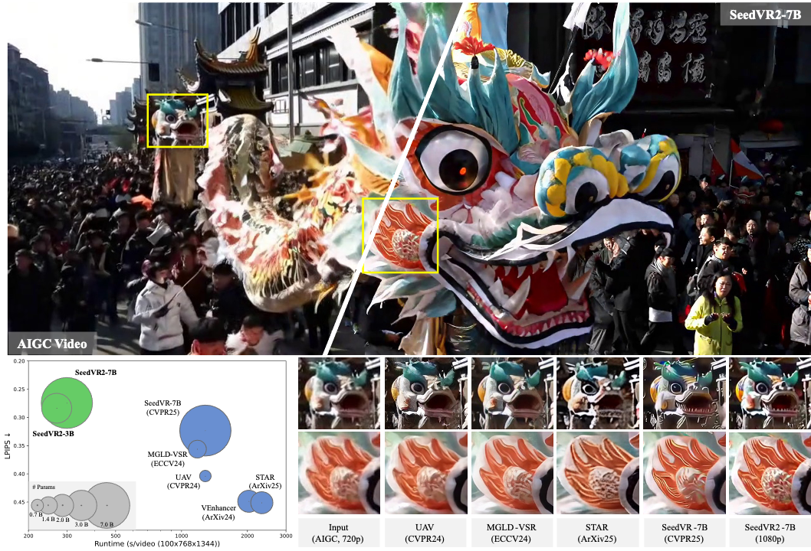

```
🔄 INFERENCE time: 333.5071804523468 seconds
💾 Processing 1 batch_samples with memory-optimized pre-allocation
📊 Total frames: 119, shape per frame: 2304x1296x3
🔄 Block 1/1: batch_samples 0-0
✅ Pre-allocation strategy completed: torch.Size([119, 2304, 1296, 3])
✅ Upscaling completed successfully!
📁 PNG frames saved in directory: bleu
🕒 Total processing time: 477.95s
⚡ Average FPS: 0.26 frames/sec
🧹 Process 34559 terminating - VRAM will be automatically freed

```


# Process 5 seconds of 24FPS 1280x720, maximum upscaling to fit all the frames in 80GB vram (takes 336s inference time)

python3 inference_cli.py --video_path original_4.mp4 --resolution 1300 --batch_size 121 --model seedvr2_ema_7b_fp16.safetensors --model_dir ./models/SEEDVR2 --output "tv5" --output_format png --preserve_vram

# Outputs on single h100 80gb pcie : 

```
(venv) root@radiant-franklin:/home/ubuntu/SeedVR2_VideoUpscaler# python3 inference_cli.py --video_path original_4.mp4 --resolution 1920 --batch_size 5 --model seedvr2_ema_7b_fp16.safetensors --model_dir ./models/SEEDVR2 --output "test_upscale_8" --output_format png --preserve_vram
🚀 SeedVR2 Video Upscaler CLI started at 2025-08-23 13:46:58
🎬 Extracting frames from video...
VRAM libre: 78.74 GB
🚀 Loading model_weight: 7b_fp16
🎯 Detected NaDiT 7B FP16
🧹 Clearing VRAM cache...
🚀 Loading VAE SafeTensors: ./models/SEEDVR2/./ema_vae_fp16.safetensors

💡 TIP: For 121 frames, use batch_size=121 to avoid padding

🎬 Batch 1: frames 0-4
📹 Sequence of 5 frames
EulerSampler: 100%|█████████████████████████████████████████████████████████| 1/1 [00:04<00:00,  4.04s/it]
🧹 Clearing VRAM cache...
🔄 INFERENCE time: 62.42505693435669 seconds

🎬 Batch 2: frames 5-9
📹 Sequence of 5 frames
EulerSampler: 100%|█████████████████████████████████████████████████████████| 1/1 [00:03<00:00,  3.96s/it]
🧹 Clearing VRAM cache...
🔄 INFERENCE time: 64.42690300941467 seconds

🎬 Batch 3: frames 10-14
📹 Sequence of 5 frames
EulerSampler: 100%|█████████████████████████████████████████████████████████| 1/1 [00:03<00:00,  3.96s/it]
🧹 Clearing VRAM cache...
🔄 INFERENCE time: 63.32576537132263 seconds

🎬 Batch 4: frames 15-19
📹 Sequence of 5 frames
EulerSampler: 100%|█████████████████████████████████████████████████████████| 1/1 [00:03<00:00,  3.97s/it]
🧹 Clearing VRAM cache...
🔄 INFERENCE time: 62.66257572174072 seconds

🎬 Batch 5: frames 20-24
📹 Sequence of 5 frames
EulerSampler: 100%|█████████████████████████████████████████████████████████| 1/1 [00:03<00:00,  3.97s/it]
🧹 Clearing VRAM cache...
🔄 INFERENCE time: 60.793198108673096 seconds

🎬 Batch 6: frames 25-29

🎬 Batch 6: frames 25-29

🎬 Batch 6: frames 25-29
📹 Sequence of 5 frames
EulerSampler: 100%|█████████████████████████████████████████████████████████| 1/1 [00:03<00:00,  3.99s/it]
🧹 Clearing VRAM cache...
🔄 INFERENCE time: 60.87646532058716 seconds

🎬 Batch 7: frames 30-34
📹 Sequence of 5 frames
EulerSampler: 100%|█████████████████████████████████████████████████████████| 1/1 [00:03<00:00,  3.97s/it]
🧹 Clearing VRAM cache...
🔄 INFERENCE time: 62.70791435241699 seconds

🎬 Batch 8: frames 35-39
📹 Sequence of 5 frames
EulerSampler: 100%|█████████████████████████████████████████████████████████| 1/1 [00:03<00:00,  3.98s/it]
🧹 Clearing VRAM cache...
🔄 INFERENCE time: 61.44347620010376 seconds

🎬 Batch 9: frames 40-44
📹 Sequence of 5 frames
EulerSampler: 100%|█████████████████████████████████████████████████████████| 1/1 [00:03<00:00,  3.98s/it]
🧹 Clearing VRAM cache...
🔄 INFERENCE time: 63.87687087059021 seconds

🎬 Batch 10: frames 45-49
📹 Sequence of 5 frames
EulerSampler: 100%|█████████████████████████████████████████████████████████| 1/1 [00:03<00:00,  3.97s/it]
🧹 Clearing VRAM cache...
🔄 INFERENCE time: 63.81039071083069 seconds

🎬 Batch 11: frames 50-54
📹 Sequence of 5 frames
EulerSampler: 100%|█████████████████████████████████████████████████████████| 1/1 [00:03<00:00,  3.97s/it]
🧹 Clearing VRAM cache...
🔄 INFERENCE time: 63.83177423477173 seconds

🎬 Batch 12: frames 55-59
📹 Sequence of 5 frames
EulerSampler: 100%|█████████████████████████████████████████████████████████| 1/1 [00:03<00:00,  3.98s/it]
🧹 Clearing VRAM cache...
🔄 INFERENCE time: 63.86334443092346 seconds

🎬 Batch 13: frames 60-64
📹 Sequence of 5 frames
EulerSampler: 100%|█████████████████████████████████████████████████████████| 1/1 [00:03<00:00,  3.98s/it]
🧹 Clearing VRAM cache...
🔄 INFERENCE time: 63.92558789253235 seconds

🎬 Batch 14: frames 65-69
📹 Sequence of 5 frames
EulerSampler: 100%|█████████████████████████████████████████████████████████| 1/1 [00:03<00:00,  3.99s/it]
🧹 Clearing VRAM cache...
🔄 INFERENCE time: 62.65252351760864 seconds

🎬 Batch 15: frames 70-74
📹 Sequence of 5 frames
EulerSampler: 100%|█████████████████████████████████████████████████████████| 1/1 [00:03<00:00,  3.99s/it]
🧹 Clearing VRAM cache...
🔄 INFERENCE time: 63.77340245246887 seconds

🎬 Batch 16: frames 75-79
📹 Sequence of 5 frames
EulerSampler: 100%|█████████████████████████████████████████████████████████| 1/1 [00:03<00:00,  3.97s/it]
🧹 Clearing VRAM cache...
🔄 INFERENCE time: 63.898435831069946 seconds

🎬 Batch 17: frames 80-84
📹 Sequence of 5 frames
EulerSampler: 100%|█████████████████████████████████████████████████████████| 1/1 [00:03<00:00,  3.97s/it]
🧹 Clearing VRAM cache...
🔄 INFERENCE time: 63.67737030982971 seconds

🎬 Batch 18: frames 85-89
📹 Sequence of 5 frames
EulerSampler: 100%|█████████████████████████████████████████████████████████| 1/1 [00:03<00:00,  3.97s/it]
🧹 Clearing VRAM cache...
🔄 INFERENCE time: 63.86151123046875 seconds

🎬 Batch 19: frames 90-94
📹 Sequence of 5 frames
EulerSampler: 100%|█████████████████████████████████████████████████████████| 1/1 [00:03<00:00,  3.98s/it]
🧹 Clearing VRAM cache...


```

Todo : check if inference speed on cpu (with lots of memory channel) is anywhere near reasonable when only using e.g. the last 5 frames, and only from 720p to 1080p

download 720p video for testing (720x1280, 24fps) : 

wget "https://github.com/Athanaze/SeedVR/blob/9df38e212b237b271f7c99ea9557be076603ad45/original_4.mp4"

python3 inference_cli.py --video_path "original_4.mp4" --resolution 1920 --batch_size 5 --model seedvr2_ema_7b_fp16.safetensors --model_dir ./models/SEEDVR2 --load_cap 18 --output "test_upscale" --output_format png --preserve_vram


new guide : 

https://github.com/numz/ComfyUI-SeedVR2_VideoUpscaler?tab=readme-ov-file#%EF%B8%8F-run-as-standalone

TODO : check if inference is possible on AMD Ryzen™ AI Max+ 395 CPU and AMD Radeon™ 8060S GPU

https://www.bee-link.com/products/beelink-gtr9-pro-amd-ryzen-ai-max-395?variant=47842426224882

https://www.digitec.ch/de/s1/product/hp-z2-mini-g1a-amd-ryzen-ai-max-pro-395-128go-2to-ssd-zturbo-amd-radeon-8060s-w11p-333-amd-ryzen-ai--59299963

https://www.digitec.ch/de/s1/product/pny-workstation-nvidia-dgx-spark-prozessorfamilie-nvidia-128-gb-1000-gb-pc-59656752

PYTHONPATH=. torchrun --nproc-per-node=2 projects/inference_seedvr2_7b.py --video_path input_folder --output_dir output_folder --seed 66 --res_h 1920 --res_w 1080


<div align="center">
  
</div>

# SeedVR: Seeding Infinity in Diffusion Transformer Towards Generic Video Restoration
> [Jianyi Wang](https://iceclear.github.io), [Zhijie Lin](https://scholar.google.com/citations?user=xXMj6_EAAAAJ&hl=zh-CN), [Meng Wei](https://openreview.net/profile?id=~Meng_Wei11), [Ceyuan Yang](https://scholar.google.com/citations?user=uPmTOHAAAAAJ&hl=zh-CN), [Fei Xiao](https://openreview.net/profile?id=~Fei_xiao8), [Chen Change Loy](https://www.mmlab-ntu.com/person/ccloy/), [Lu Jiang](http://www.lujiang.info/)
>
> **CVPR 2025 (Highlight)**

<p>
  <a href="https://iceclear.github.io/projects/seedvr/">
    
  </a>
  <a href="https://huggingface.co/collections/ByteDance-Seed/seedvr-6849deeb461c4e425f3e6f9e">
    
  </a>
   <a href="https://huggingface.co/spaces/ByteDance-Seed/SeedVR2-3B">
    
  </a>
  <a href="https://github.com/numz/ComfyUI-SeedVR2_VideoUpscaler">
    
  </a>
  <a href="https://arxiv.org/abs/2501.01320">
    
  </a>
  <a href="https://www.youtube.com/watch?v=aPpBs_B2iCY" target='_blank'>
    
  </a>
</p>

>
> **Why SeedVR:** Conventional restoration models achieve inferior performance on both real-world and AIGC video restoration due to limited generation ability. Recent diffusion-based models improve the performance by introducing diffusion prior via ControlNet-like or adaptor-like architectures. Though gaining improvement, these methods generally suffer from constraints brought by the diffusion prior: these models suffer from the same bias as the prior, e.g., limited generation ability on small texts and faces, etc, and only work on fixed resolutions such as 512 or 1024. As a result, most of the existing diffusion-based restoration models rely on patch-based sampling, i.e., dividing the input video into overlapping spatial-temporal patches and fusing these patches using a Gaussian kernel at each diffusion step. The large overlap (e.g., 50\% of the patch size), required for ensuring a coherent output without visible patch boundaries, often leads to considerably slow inference speed. This inefficiency becomes even more pronounced when processing long videos at high resolutions. SeedVR follows SOTA video generation training pipelines to tackle the key challenge in diffusion-based restoration, i.e., by enabling arbitrary-resolution restoration w/o relying on any pretrained diffusion prior and introducing advanced video generation technologies suitable for video restoration. Serving as the largest-ever diffusion transformer model towards generic video restoration, we hope SeedVR could push the frontiers of advanced VR and inspire future research in developing large vision models for real-world video restoration.


# SeedVR2: One-Step Video Restoration via Diffusion Adversarial Post-Training
> [Jianyi Wang](https://iceclear.github.io), [Shanchuan Lin](https://scholar.google.com/citations?user=EDWUw7gAAAAJ&hl=en), [Zhijie Lin](https://scholar.google.com/citations?user=xXMj6_EAAAAJ&hl=en), [Yuxi Ren](https://scholar.google.com.hk/citations?user=C_6JH-IAAAAJ&hl=en), [Meng Wei](https://openreview.net/profile?id=~Meng_Wei11), [Zongsheng Yue](https://zsyoaoa.github.io/), [Shangchen Zhou](https://shangchenzhou.com/), [Hao Chen](https://haochen-rye.github.io/), [Yang Zhao](https://scholar.google.com/citations?user=uPmTOHAAAAAJ&hl=en), [Ceyuan Yang](https://ceyuan.me/), [Xuefeng Xiao](https://scholar.google.com/citations?user=CVkM9TQAAAAJ&hl=en), [Chen Change Loy](https://www.mmlab-ntu.com/person/ccloy/index.html), [Lu Jiang](http://www.lujiang.info/)

<p>
  <a href="https://iceclear.github.io/projects/seedvr2/">
    
  </a>
  <a href="https://huggingface.co/collections/ByteDance-Seed/seedvr-6849deeb461c4e425f3e6f9e">
    
  </a>
  <a href="https://huggingface.co/spaces/ByteDance-Seed/SeedVR2-3B">
    
  </a>
  <a href="https://github.com/numz/ComfyUI-SeedVR2_VideoUpscaler">
    
  </a>
  <a href="http://arxiv.org/abs/2506.05301">
    
  </a>
  <a href="https://www.youtube.com/watch?v=tM8J-WhuAH0" target='_blank'>
    
  </a>
</p>

>
> Recent advances in diffusion-based video restoration (VR) demonstrate significant improvement in visual quality, yet yield a prohibitive computational cost during inference. While several distillation-based approaches have exhibited the potential of one-step image restoration, extending existing approaches to VR remains challenging and underexplored, due to the limited generation ability and poor temporal consistency, particularly when dealing with high-resolution video in real-world settings. In this work, we propose a one-step diffusion-based VR model, termed as SeedVR2, which performs adversarial VR training against real data. To handle the challenging high-resolution VR within a single step, we introduce several enhancements to both model architecture and training procedures. Specifically, an adaptive window attention mechanism is proposed, where the window size is dynamically adjusted to fit the output resolutions, avoiding window inconsistency observed under high-resolution VR using window attention with a predefined window size. To stabilize and improve the adversarial post-training towards VR, we further verify the effectiveness of a series of losses, including a proposed feature matching loss without significantly sacrificing training efficiency. Extensive experiments show that SeedVR2 can achieve comparable or even better performance compared with existing VR approaches in a single step.

<p align="center"></p>


## 📢 News

We sincerely thank all contributors from the open community for their valuable support.

- **June 22, 2025:** Huge thanks [NumZ](https://github.com/numz) for building the [ComfyUI](https://github.com/numz/ComfyUI-SeedVR2_VideoUpscaler) [](https://github.com/numz/ComfyUI-SeedVR2_VideoUpscaler)!
- **June 11, 2025:** Repo created.


## 📮 Notice
**Limitations:** These are the prototype models and the performance may not perfectly align with the paper. Our methods are sometimes not robust to heavy degradations and very large motions, and shares some failure cases with existing methods, e.g., fail to fully remove the degradation or simply generate unpleasing details. Moreover, due to the strong generation ability, Our methods tend to overly generate details on inputs with very light degradations, e.g., 720p AIGC videos, leading to oversharpened results occasionally (especially on small resolutions, e.g., 480p).


## 🔥 Quick Start

1️⃣  Set up environment
```bash
git clone https://github.com/bytedance-seed/SeedVR.git
cd SeedVR
conda create -n seedvr python=3.10 -y
conda activate seedvr
pip install -r requirements.txt
pip install flash_attn==2.5.9.post1 --no-build-isolation
```

Install [apex](https://github.com/NVIDIA/apex).
If you encounter problems when installing apex from source, we provide two pre-build whl here:
- [apex-0.1-cp39-cp39-linux_x86_64.whl](https://huggingface.co/ByteDance-Seed/SeedVR2-3B/resolve/main/apex-0.1-cp39-cp39-linux_x86_64.whl): for python=3.9, torch=2.4.0, cuda=12.4
- [apex-0.1-cp310-cp310-linux_x86_64.whl](https://huggingface.co/ByteDance-Seed/SeedVR2-3B/resolve/main/apex-0.1-cp310-cp310-linux_x86_64.whl): for python=3.10, torch=2.4.0, cuda=12.1
```bash
pip install apex-0.1-cp310-cp310-linux_x86_64.whl
```

To use color fix, put the file [color_fix.py](https://github.com/pkuliyi2015/sd-webui-stablesr/blob/master/srmodule/colorfix.py) to `./projects/video_diffusion_sr/color_fix.py`.


2️⃣  Download pretrained checkpoint
```python

# Take SeedVR2-3B as an example.
# See all models: https://huggingface.co/models?other=seedvr

from huggingface_hub import snapshot_download

save_dir = "ckpts/"
repo_id = "ByteDance-Seed/SeedVR2-3B"
cache_dir = save_dir + "/cache"

snapshot_download(cache_dir=cache_dir,
  local_dir=save_dir,
  repo_id=repo_id,
  local_dir_use_symlinks=False,
  resume_download=True,
  allow_patterns=["*.json", "*.safetensors", "*.pth", "*.bin", "*.py", "*.md", "*.txt"],
)

```

## 🔥 Inference

You need to set the related settings in the inference files.      

**GPU Requirement:** We adopt sequence parallel to enable multi-GPU inference and 1 H100-80G can handle videos with 100x720x1280. 4 H100-80G further support 1080p and 2K videos (sp_size=4). We will support more inference tricks like [Tile-VAE](https://github.com/pkuliyi2015/multidiffusion-upscaler-for-automatic1111) and [Progressive Aggregation Sampling](https://github.com/IceClear/StableSR) in the future.      

```python
# Take 3B SeedVR2 model inference script as an example
torchrun --nproc-per-node=NUM_GPUS projects/inference_seedvr2_3b.py --video_path INPUT_FOLDER --output_dir OUTPUT_FOLDER --seed SEED_NUM --res_h OUTPUT_HEIGHT --res_w OUTPUT_WIDTH --sp_size NUM_SP
```


## ✍️ Citation

```bibtex
@article{wang2025seedvr2,
      title={SeedVR2: One-Step Video Restoration via Diffusion Adversarial Post-Training},
      author={Wang, Jianyi and Lin, Shanchuan and Lin, Zhijie and Ren, Yuxi and Wei, Meng and Yue, Zongsheng and Zhou, Shangchen and Chen, Hao and Zhao, Yang and Yang, Ceyuan and Xiao, Xuefeng and Loy, Chen Change and Jiang, Lu},
      booktitle={arXiv preprint arXiv:2506.05301},
      year={2025}
   }

@inproceedings{wang2025seedvr,
      title={SeedVR: Seeding Infinity in Diffusion Transformer Towards Generic Video Restoration},
      author={Wang, Jianyi and Lin, Zhijie and Wei, Meng and Zhao, Yang and Yang, Ceyuan and Loy, Chen Change and Jiang, Lu},
      booktitle={CVPR},
      year={2025}
   }
```


## 📜 License
SeedVR and SeedVR2 are licensed under the Apache 2.0.
